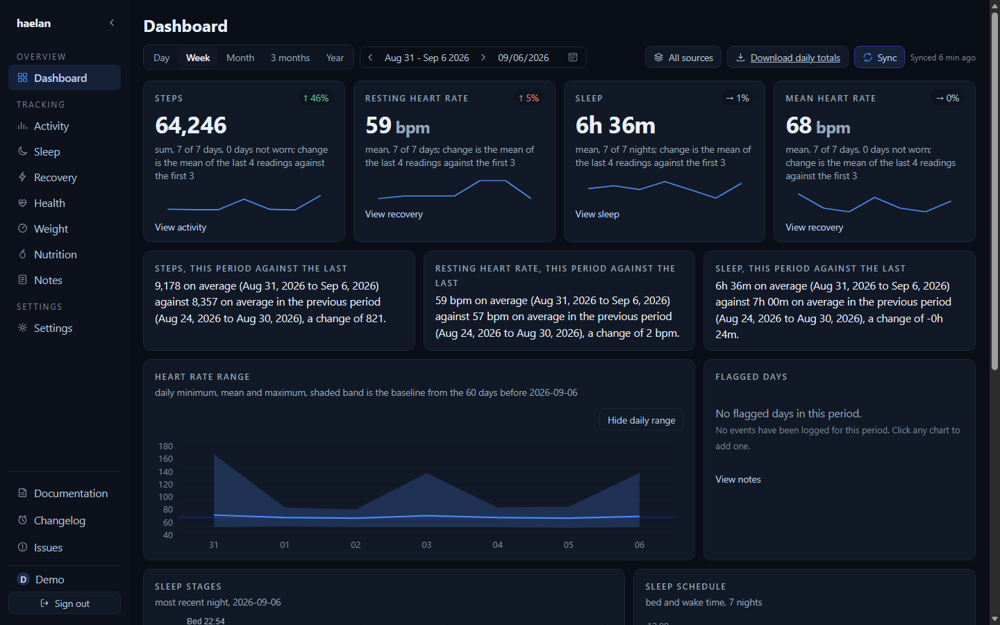
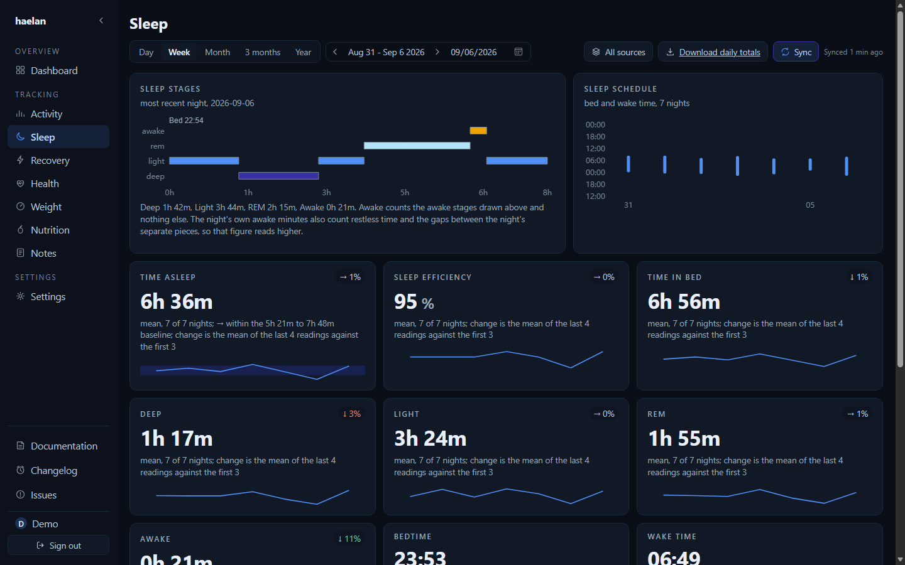

# Hælan

*Hælan* is Old English for "to heal, to make whole" — the root of both *heal* and *health*. The
package, the image and the command are all `haelan`.

**A self-hosted dashboard and local mirror for your own health data, built on the Google Health
API v4.** One household, one instance, no telemetry, no hosted offering.

[](https://github.com/bardesss/haelan/actions/workflows/ci.yml)
[](LICENSE)
[](https://github.com/bardesss/haelan/releases)
[](https://github.com/bardesss/haelan/pkgs/container/haelan)

The reason it is self-hosted is structural rather than ideological. Google caps an unverified
OAuth client at 100 users, and clearing verification for health scopes needs a paid third-party
security assessment. A hosted dashboard therefore stalls at a hundred signups no matter how good
it is. An instance whose only users are the people who own its OAuth client never meets that cap.
The direct cost is that every household brings its own Google Cloud project; the direct benefit is
that no ceiling exists.

## Written by an AI agent

**Every line of haelan was written by a coding agent, with a human deciding what got built, what
got rejected, and what got merged.** That is stated here rather than in a footnote because you are
considering pointing this at your own health record, and it should inform that decision rather than
surprise you later.

What it means in practice: nothing merges without tests, every pull request is reviewed - by a
second agent and by a human - and the numbers in this README and in `ROADMAP.md` are measured
against a real instance rather than estimated. The one figure that is not, the time this release's
rebuild will take on a database larger than any that has been timed, is marked as an extrapolation
where it appears. Where something is unverified, it says so.

What it does not mean: no security professional has audited this. It has one household's worth of
production use. `CONTRIBUTING.md` documents five failure modes that have actually produced wrong
work in this repository - a green test that never failed for the right reason, an assertion matching
a substring instead of a value, a claim about a file nobody opened - because they recur, and
catching them is a standing part of how the project is built rather than a past embarrassment.





<sub>Dashboard, Sleep, and [Recovery](assets/screenshots/recovery.png). All three are the demo data
`scripts/seed-demo.mjs` generates, not anybody's real health history.</sub>

## What it does

### 📦 A complete local mirror

Your whole history in one SQLite file, kept past Google's retention windows and surviving you
losing access to the API. Intraday samples in particular have a shelf life at the source, so a
mirror is the only place minute-level history stays available at that resolution.

### 📊 Eight pages of it

Dashboard, Activity, Sleep, Recovery, Health, Weight, Nutrition and Notes: sleep with stages and
nap detection, resting heart rate and HRV, SpO2 with its confidence interval, an activity heatmap
and a workout list, an intraday chart, a weight trend, and period-over-period insight cards that
withhold themselves, each with its own reason, when the data behind them is thin. English and
Dutch throughout. Nutrition is the one page with nothing on it: this household has never logged
food, and the API's Food type carries no timestamp to file a meal under, so the page says so
rather than inventing a data model to have something to draw.

### 📐 Personal baselines

A reading is shown against your own 60 day baseline, because "96 bpm" carries no information on
its own and "1.4 standard deviations above your baseline" does. A baseline computed from too few
days is flagged as thin rather than quietly presented as one.

### 📝 Context a stateless dashboard cannot have

Daily notes and typed events (illness, travel, alcohol, medication, injury, and any other kind you
name) become analysis variables, so "how do I sleep after a late flight" is answerable rather than
guessable.

### ✂️ Corrections that do not rewrite history

A glitching strap reporting 210 bpm is excluded by an override applied at derivation time; the
raw payload is never modified, and removing the override restores the original value exactly.

### 👥 Household multi-user

A few people, one instance, each seeing only their own data. An admin invites a member, the member
chooses their own password, and each person connects their own Google account and picks which data
types get fetched for them.

## Deploy

[`compose.yaml`](compose.yaml) at the repository root is eight lines of YAML and carries no
environment variables at all. It needs no editing, because every value the server reads already
has a working default.

```
docker compose up -d
```

Then open `http://localhost:4235`. The database is empty, so the setup wizard runs. It asks for
four things in order: an admin account, the address this instance is reached at, a Google OAuth
client, and consent. After that it asks which data types to fetch and how far back to backfill.

### The one manual step

Somebody has to create a Google Cloud project and an OAuth client once, in the console. Google
exposes no API for that, and the credentials must belong to whoever owns the data, which is
precisely what keeps an instance out of the verification ceiling described above. The setup wizard
makes that step guided, validated and copy-paste driven. It cannot make it disappear, and any
documentation claiming otherwise would be lying.

The wizard walks you through it and prints the exact values to paste. What you do in the console,
in the order it asks:

1. Open [console.cloud.google.com](https://console.cloud.google.com) and create a project, or pick
   an existing one.
2. Under **APIs and services**, enable the **Google Health API**.
3. Configure the OAuth consent screen and declare the eleven read-only scopes the wizard lists,
   including the data types you do not want today: declaring is once, granting is per person, and
   a scope you skip now means a second visit later.
4. Set publishing status to **In production**. Leaving it in Testing gives every refresh token a
   seven day life, and the household's sync stops a week after setup with no obvious cause.
5. Create an OAuth client of type **Web application** and register every redirect URI the wizard
   shows, in one pass. An unused URI costs nothing; a missing one costs a return trip.
6. Copy the client ID and secret into the wizard.

Your client stays unverified, so everyone granting consent sees an unverified app warning. That is
expected here and is not a sign anything is wrong: verification exists to lift a hundred user cap
a household instance never reaches.

### Two things worth knowing before you rely on this

- **Consent needs an HTTPS or loopback address.** Google's OAuth console refuses a raw IP as a
  redirect target and requires HTTPS for anything that isn't localhost, so a browser on the same
  machine the instance runs on works out of the box. Reaching consent from another device on the
  LAN needs either Tailscale, whose `ts.net` names carry a real certificate, or a reverse proxy
  holding a certificate for a domain you own. Recorded from a real walk through the console at
  [`probe/findings/console-steps.md`](probe/findings/console-steps.md).
- **Leave room for a second copy of the database in free disk.** The daily backup and the
  boot-time reclaim each write a whole new file before anything old is replaced or freed, so each
  needs room for another copy of what the database holds, with a margin. Neither runs when it
  cannot: both read free space first and decline, visibly, rather than filling the disk.

## Configuration

There is nothing to configure. Every variable below has a working default, and they exist for
people who disagree rather than for people installing.

| Variable | Default | What it is for |
|---|---|---|
| `HAELAN_DATA_DIR` | `/data` | Where the database, the key and the backups live |
| `HAELAN_PORT` | `4235` | The port the server listens on |
| `HAELAN_HOST` | `0.0.0.0` | The address it binds to |
| `HAELAN_BACKUP_KEEP` | `7` | How many backups to keep; `0` turns backups off |
| `HAELAN_BACKUP_INTERVAL_HOURS` | `24` | How often one is taken |
| `HAELAN_ENCRYPTION_KEY` | generated | Holding the key yourself instead of in a file beside the database |

### What is in the data directory

`haelan.sqlite` is the database: the archived payloads, everything derived from them, and every
note, event and override. `instance.key` is the 44 byte file that decrypts the stored Google
credentials, and it is deliberately **not** in a backup, so keep a copy of it somewhere separate.
`backups/` holds the compacted daily copies.

## Storage, and how it grows

Every number below was measured on the author's own instance: one person, 741 days of history.
They are here so you can size a volume before you start rather than after the disk fills.

After a reclaim the database holds **247 MB** for those 741 days, which is about **120 MB per
person-year**. Of that, the gzipped raw archive is roughly **122 MB** and the derived samples with
their two indexes roughly **160 MB** - the two overlap somewhat in how they were measured, so they
do not sum exactly to the total. Intraday heart rate is the bulk of it: a reading every few
seconds, collapsed to three rows a minute.

**Backups multiply it.** The default keeps seven daily copies, each a compacted copy of the whole
database, so a 247 MB instance carries roughly **1.7 GB of backups** on top of it.
`HAELAN_BACKUP_KEEP` changes how many are kept, and `0` turns backups off for an operator who backs
the volume up some other way.

**The boot vacuum needs headroom of its own.** It declines to run unless free disk exceeds the live
content by 20%, because `VACUUM` builds a whole new file before the old one is replaced. It says so
in the log rather than filling the disk.

Put together, a realistic steady state for one person after two years, on defaults, is roughly **2
GB** - about a quarter of it the database, the rest its backups.

The archive does not shrink to save space, and that is deliberate rather than an oversight: it is
the only complete record once Google's own retention window has passed, so pruning it trades away
the one thing that makes a rebuild - re-deriving samples and daily rows from scratch - possible at
all. Intraday data carries the same asymmetry from the other end: the API itself only retains it
briefly, so once a window has aged out at the source it cannot be re-fetched at that resolution no
matter how much local disk is free. Growth here is the cost of what this project is for.

## Try it without a Google account

`scripts/seed-demo.mjs` writes a year of generated data into an empty directory and leaves the
setup wizard already finished, so an instance boots straight past it, signed in, with a year of
history to browse. The seed's own span is fixed rather than tied to today - reproducibility over
currency, `DEMO_END_DATE` in the script says why - so the default landing view can read thin once
real time drifts past it even though the year behind it has not gone anywhere.

```
pnpm install
pnpm build
node --experimental-strip-types scripts/seed-demo.mjs ./demo-data
HAELAN_DATA_DIR=./demo-data pnpm start
```

Sign in as `demo` with the password `demodemo`. That password is printed by the script and
written down here on purpose: it is correct for a throwaway directory and wrong for anything else,
and the script refuses to run against a directory that already holds a database. The data comes
from a fixed seed, so the data behind the screenshots above regenerates identically. The images
themselves were taken on the week ending 2026-09-06, which is where the demo's data ends; a fresh
boot opens on the current month instead, and you would have to walk back to that week to frame the
same pictures.

## Backups, and restoring one

An instance takes a compacted copy of its database once a day into `backups/` inside the data
directory, keeps the newest seven, and does it while the app is running. `HAELAN_BACKUP_KEEP` and
`HAELAN_BACKUP_INTERVAL_HOURS` change that; `HAELAN_BACKUP_KEEP=0` turns it off for an operator who
backs the volume up by other means. Settings shows when the last one was taken and can take one now.

A file appears in `backups/` only after it has been written, opened, integrity-checked and
row-counted against the live database. A copy that fails any of those keeps a `.part` extension,
which nothing restores, nothing counts, and no schedule accepts - so a failed backup is visible as
a symptom and can never be mistaken for a good one. The most recent failure is kept until a later
backup succeeds, so there is always something to look at.

**A backup does not contain `instance.key`.** That file, beside the database, encrypts the stored
Google credentials, and a backup that carried it would itself be a credential - and backups are
exactly the files people copy to a NAS, a cloud folder, or a support thread. Keep a copy of the key
somewhere separate. It is 44 bytes.

To restore, with the container stopped:

1. move the chosen file from `backups/` over `haelan.sqlite`
2. **delete any `haelan.sqlite-wal` and `haelan.sqlite-shm` beside it.** They belong to the database
   you just replaced, and SQLite applying a stale write-ahead log to a restored file is the one way
   this procedure corrupts the thing it is repairing
3. leave `instance.key` where it is - it is not in the backup and is not replaced
4. start the container

Restoring onto a machine that still has its original `instance.key` needs nothing further.

Restoring onto one that does not is supported, and it costs exactly what that key was holding: the
household's Google client secret and every person's stored refresh token. The health data is
intact. The instance writes itself a fresh `instance.key` on that first boot and comes up asking
for the Google client again, because a client secret nobody can decrypt is a client that has to be
set up again. Sign in, paste the client ID and secret back in from your Google Cloud console -
which is where they still are - and then connect each person once, the way setup did the first
time.

Nothing is deleted along the way, so the old key is worth keeping even after you have given up on
it. Put it back - container stopped, over the key the instance generated - and every row that was
sealed under it opens again.

But only those rows, and that is the catch worth reading twice. Anything you re-entered or
re-consented in the meantime was sealed under the *new* key, and restoring the old one takes it
straight back off you: the Google client if you pasted it in again, and every person who
reconnected. So putting the original key back is worth doing **before** you repair anything, and a
poor trade afterwards - by then the repair is the thing that works, and the old key undoes it.

Worth doing once, on a copy, before you need it: the procedure is four steps and the day you first
run it should not be the day it matters.

## If you forget your password

There is no reset link, and there is no route that offers one. An instance with no mail server and
no second factor has nothing to prove that a reset request came from the person it names, so the
proof is physical access to the machine the container runs on. That is what the console tool is.

```
docker exec -it haelan node --experimental-strip-types apps/server/src/admin.ts list
docker exec -it haelan node --experimental-strip-types apps/server/src/admin.ts passwd robin
```

`list` prints every account with whether it is an admin, whether it is disabled, and whether it is
locked and until when. It never prints a hash. `passwd` asks for the new password twice on stdin,
echoes neither, and then writes a fresh argon2id hash and clears the lockout that a forgotten
password usually arrives with. `unlock <username>` clears only the lockout and leaves the password
alone, which is what somebody needs who knows theirs and ran out of attempts: ten wrong ones lock
an account for fifteen minutes.

**No password is ever an argument**, and the tool refuses one given as such rather than ignoring
it. `passwd robin hunter2` would sit in your shell history and be readable in `ps` by every other
user on that machine.

Outside a container it is the same command against the same data directory:

```
HAELAN_DATA_DIR=./data node --experimental-strip-types apps/server/src/admin.ts list
```

It declines rather than waits when a rebuild has the database. An upgrade that changes how data is
derived re-derives each person inside one transaction and holds SQLite's only write lock for as
long as that takes, so `passwd` and `unlock` say the database is busy and change nothing instead of
failing somewhere in the middle. `list` answers throughout, because readers do not queue behind a
writer.

## Upgrading

**Most upgrades cost nothing.** Pull the new image and start it. The schema migrates in
milliseconds, the app comes up, and nothing else happens.

An upgrade costs more than that only when a release changes how your data is *derived* - what a
reading means, how a night is assembled, which rows a metric produces. Every person's derived rows
carry the mapping and derivation versions that built them, and a release that moves either one
rebuilds them from the raw archive, because rows built by the old rules sitting beside rows built
by the new ones is the one outcome worth spending minutes to avoid.

Between them those two counters have moved ten times across this project's first hundred merged
changes, and some of those were a single change moving both. **The other nine in ten boot straight
up.** Nothing about a release on its own costs you a rebuild; only what is in it does.

When it does happen, this is the shape of it, using the largest one so far as the example.

**Upgrading past M5d-A costs one rebuild.** Migration 0016 drops `samples` rather than translating
it, so the first boot after this release rebuilds tier 2 from the archive; measured at 11 minutes
36 seconds on 1.6 million rows over 741 days. The dashboard is reachable while that runs, and its
intraday charts are empty for the duration, which is not distinguishable from a day with no data.
The database file does not shrink: live content falls from 632.4 MB to 246.8 MB measured like for
like, but SQLite keeps the freed pages on its freelist - about 595 MB - and returns them to the
operating system only on a `VACUUM`. **M5d-B/C now runs one**, once per boot, when more than a
fifth of the file and more than 64 MiB of it are dead and the disk can hold a second copy while it
works. Measured on the author's database, upgrading from the pre-M5d schema: **21 seconds, and 645
MB handed back**, taking the file from 891 MB to 247 MB. The app stalls for those 21 seconds rather
than stopping, and it happens once - the boots after it find too little dead space to bother.

**This release costs one rebuild as well.** Workout detail pages read fields the session mapper
used to drop on the floor - the automatic splits, the pause markers, moving time, the workout's own
name - so the mapping version moves from 4 to 5 and every person's derived rows are rebuilt from
the raw archive on the first boot after the upgrade. That is the point of spending it: the archive
still holds the full payload of every workout you have ever synced, so the runs you recorded last
year become as detailed as the ones you record tomorrow, with nothing re-fetched from the provider.

What it costs is set by how much archive you have, not by what changed in this release, because a
rebuild reads every archived payload back and re-derives from it either way. **One rebuild has ever
been timed on this project**, the M5d-A one above: 11 minutes 36 seconds on 1.6 million sample rows
over 741 days. The author's instance has grown since that measurement was taken and now holds
2,138,327 sample rows, 15,982 archived payloads and 434 sessions - about a third more rows - and no
rebuild has been timed at that size. Scaling the one measured figure by that growth puts this one a
little over 15 minutes, which is an extrapolation from a single measurement rather than something
anybody has observed, and it is the only basis this README has for a number. A smaller history is
quicker in proportion; a slower disk is not.

While it runs, that person's sync is paused - the runner skips anyone waiting on a rebuild rather
than writing new rows under one set of rules beside old rows written under another - and the
dashboard stays reachable with its intraday charts empty, which is not distinguishable from a day
with no data. Both come back on their own when it finishes. It happens once: the next boot finds
the person stamped at the current version and starts normally.

## Roadmap

Five milestones are done and the sixth is finishing: the store and sync engine, the derivation
layer, eight dashboard pages, then packaging, people, backups and the upgrade path. The agent
surface ships too: an MCP server with typed tools, reachable over stdio and over HTTP behind a
per-account token, including `sql_query` behind its own sandbox.

**[ROADMAP.md](ROADMAP.md)** has the table, every milestone's pull request, and why the order is
what it is.

## The name

*Haelan* is Old English **hǣlan**, "to heal, to cure, to make whole". It shares a root with
**hāl**, "whole, sound, hale", and it is the word English later turned into *health* by way of
**hǣlþ**, literally the state of being whole.

That is the right idea for this project. A dashboard that shows you today's numbers is reporting
on a fragment. The point of keeping a complete local history, with your own notes and events
beside it, is to see the whole rather than the reading.

The name also stays deliberately clear of the API it reads. Calling this "Google Health
something" would borrow a trademark for no benefit; the positioning is that haelan works with the
Google Health API, not that it is part of it.

## Non-goals

- A hosted, multi-tenant service. Running one would inherit the exact cap this design exists to
  avoid.
- Public internet exposure. The instance binds to localhost or a LAN and is reached through a
  reverse proxy or Tailscale. There is no public deployment story.
- Writing data back to Google. Read only in v1.

## Layout

```
packages/core     the only package that issues SQL or talks to Google
packages/tokens   design tokens, emitted to CSS custom properties
apps/server       Fastify: routes, cookies, the scheduler, the setup wizard's API
apps/web          React and Vite: the dashboard and the setup wizard
scripts/          the demo seed, the enum drift check and the image boot check
assets/           the screenshots above
probe/            M0 throwaway scripts and the findings three plans still cite
```

`probe/` was going to be deleted once M1 landed, and that is now due. It is staying anyway, and
the promise was the wrong one: `probe/scripts/` is throwaway and `probe/findings/` is not.
Three plans cite the findings, the wizard's console copy is derived from them, and the redirect
URI rules quote them directly. Deleting the measurements to keep a tidying promise would leave
the code asserting things with no recorded source. The scripts go when something needs the
space; the findings stay.

`packages/core/README.md` documents the store and the API client, `apps/server/README.md` the
HTTP surface, `apps/web/README.md` the dashboard and the wizard, and
[`TOOLS.md`](TOOLS.md) the MCP tool surface an agent reads through on either transport, and how to
connect over HTTP.

Specs and plans live under `docs/superpowers/` and are deliberately not tracked: they are working
documents for whoever is building, not part of what ships.

## Translations

The app ships English and Dutch, both complete at 716 keys. Locales are plain JSON
(`apps/web/src/i18n/en.json`, `apps/web/src/i18n/nl.json`), imported and registered in a
`resources` map in `apps/web/src/i18n/index.tsx`; `fallbackLng` is `en`. The language is derived
from the browser's `navigator.language` - there is no in-app language switch.

Adding one is three steps: copy `en.json`, translate its 716 keys, then import and register it
beside `en` and `nl`. Translate all of them. i18next falls back per key rather than per file, so a
half-finished locale does not show the fallback language throughout - it shows one screen carrying
two languages at once, which is worse than shipping no locale at all.

## Development

```
pnpm install
pnpm test
pnpm typecheck
git config core.hooksPath .githooks
```

That last line is once per clone. It enables `.githooks/commit-msg`, which refuses a commit
message carrying a Claude Code session link. CI checks the same rule on every push and pull
request, so the hook is fast feedback rather than the guarantee, and forgetting it costs a red
build instead of a bad commit reaching `master`.

Two processes in development, in separate terminals. Vite serves the app and proxies `/api` and
`/oauth` to Fastify, so the browser sees one origin and the session cookie behaves exactly as it
does in production behind one port.

```
pnpm dev:server      Fastify on 4235
pnpm dev             Vite, proxying to it
```

For the single port arrangement production uses, build the bundle first and run the server
alone: it serves `apps/web/dist` when that directory exists.

```
pnpm build
HAELAN_DATA_DIR=./.local-data pnpm start
```

`pnpm start` runs from the repository root, so a relative `HAELAN_DATA_DIR` is relative to the
root too. The server prints the resolved absolute path at boot, so there is never a question
about which database an instance opened.

Node 22.13 or later. The suite runs against temporary SQLite databases and needs no credentials:
every payload it reads is synthetic, and the one test that speaks HTTP speaks it to a stub on
localhost.

## License

AGPL-3.0-only. Full text in [`LICENSE`](LICENSE). If you fork haelan and run a modified version as
a network service, the AGPL requires you to publish your changes to the people using that service.

## Contributing

The bar is written down in advance rather than decided per pull request: what would be accepted,
what would not, the house conventions, and what a change touching derivation or mapping owes. It is
all in [CONTRIBUTING.md](CONTRIBUTING.md).

haelan is built with a coding agent, and AI-assisted contributions are welcome, held to the same
bar as everything else here. CONTRIBUTING.md has a section written to be read by one.

Real health data never gets committed. Archived payloads stay gitignored and every test fixture is
synthetic, generated by `packages/core/src/testing/seed.ts`, which exists so that nobody is ever
tempted to paste in a real day.
